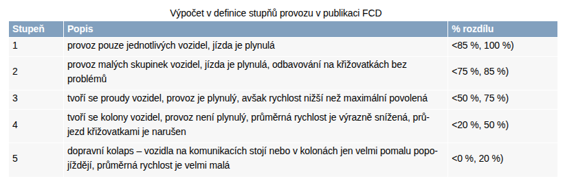

## Počasí
Informace o počasí čerpám z https://opendata.chmi.cz/meteorology/climate/historical_csv/. Pracovat budu pouze s denními daty z jedné měřicí stanice a to z profesionální stanice Praha Karlov:
- wsi: 0-20000-0-11519
- gh_id: P1PKAR01
- souřadnice: 14.4186,50.0675
- nadmořská výška: 260.5 m. n. m.
(zdroj: meta1.csv)

Zajímají mě konkrétně tyto veličiny:
- Rychlost větru (F), m/s, 8.5 metrů nad zemí, průměr z měření v 07:00, 14:00 a 21:00
- Výška sněhu (SCE), cm, 0 metrů nad zemí, měřeno v 06:00 (viz dly-0-20000-0-11519-SCE.csv)
- Srážka (SRA), mm, 1.11 metrů nad zemí, měřeno od 6:00 daného dne do 6:00 následujícího
- Sluneční svit (SSV), hod, 1.5, měřeno od 00:00 do 24:00 daného dne
- Teplota (T),°C,1.99, průměr z měření v 07:00 14:00 a 21:00
(zdroj: meta2.csv)

## MHD
### Metro
Mám denní data od 1. 1. 2020. Znám počty vstupů a výstupů, budu pouzívat maximum z těchto hodnot.
### Povrchová doprava
Denní počty cestujících od 1. 1. 2021.

## Cyklodoprava
Po průzkumu dostupých dat mám k dispozici počty cyklistů z 61 sčítačů z nichž 16 má 10-25% chybějících/nulových hodnot.  
Polohy sčítačů:  

## Automobilová doprava
Nejprve jsem o data požádala společnost Golemio, která zpracovává data a tvoří různé grafické analýzy pro Prahu. Nabídli mi tyto vzorky:  
### Floating Car Data
Data možná získat za období od 1.6.2020

https://registr.dopravniinfo.cz/cs/index.html

Sloupce, které by mohly být zajímavé:
- source_identification - id daného úseku (viz TCM lokační tabulky)
- measurement_or_calculation_time - čas získní záznamu
- traffic_level (1-5)  
  
- ~~queue_exists~~ - konstantní hodnota False
- ~~queue_length~~ - nemá hodnoty
- average_vehicle_speed = aktuální průměrná rychlost
- travel_time = aktuální průměrná dojezdová doba
- free_flow_travel_time = doba volného průjezdu
- free_flow_speed = rychlost volného průjezdu (často vozidla maximální povolená rychlost)

O tato data jsem se nakonec rozhodla požídat přímo Ředitelství silnic a dálnic jakožto poskytovatele těchto dat. Tento zdroj chci využít jako primární. Pravděpodobně získám i údaj o počtu automobilů, které projely určitým úsekem. O konkrétní úseky aktuálně žádám.

### NDIC
Data možná získat za období od 1.9.2021
Informace o dopravních událostech - nehody, uzavírky apod.

### Waze - route lives
Časy dojezdností https://golemio.cz/data/doprava

Některé ty první/brzké jsou zhruba od 30.9.2021 a všechny ostatní se přidávaly různě postupně v čase i napříč roky. Tak některé jsou mnohdy i dost později definované a sbírané, např. mosty nebo tunely atd.

Vzorky jsou za 3 trasy a jeden den:

- ID 22690; 1a. Z ul. 5. května přes Legerovu a Wilsonovu k Bubenské ul. (z centra),
- ID 22694; 18b. Tunely Blanka => Strahov => Zlíchov - z ul. V Holešovičkách na Strakonickou (S-J),
- ID 24260; 19a. Vítězné nám. => Evropská => LKPR (z centra)

Sloupce:
- time - čas průjezdu
- length - délka trasy (samozřejmě konstantní pro každou trasu)
- jam level - hodnoty 0 až 4

Zajímavá data, ale údaje je možné vypočítat z Floating Car Data.

### Waze - alerts
Upozornění na dopravní události z aplikace Waze.  
Data od 1.1.2019

### Waze - irregularities
Data z aplikace Waze, informace o dopravních zácpách, zpoždění a podobně.

### Waze - jams
Data z aplikace Waze, informace o dopravních zácpách.
Data od 1.1.2019
