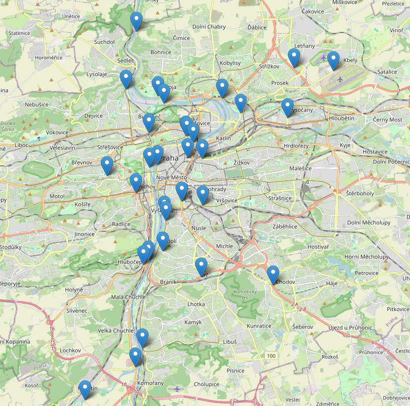

## Počasí
Informace o počasí čerpám z https://opendata.chmi.cz/meteorology/climate/historical_csv/. Pracovat budu pouze s denními daty z jedné měřicí stanice a to z profesionální stanice Praha Karlov:
- wsi: 0-20000-0-11519
- gh_id: P1PKAR01
- souřadnice: 50.0692N, 14.4278E
- nadmořská výška: 260.5 m. n. m.
(zdroj: meta1.csv)

Výšku sněhové pokrývky bylo nutné brát z jiné stanice, protože tato stanice od 1. 9. 2024 přestala tyto hodnoty měřit. Vybrala jsem tedy stanici Praha Vinohrady - Flora (0-203-0-11201020001).

Zajímají mě konkrétně tyto veličiny:
- Rychlost větru (F), m/s, 8.5 metrů nad zemí, průměr z měření v 07:00, 14:00 a 21:00 (AVG)
- Výška sněhu (SCE), cm, 0 metrů nad zemí, měřeno v 06:00 (viz dly-0-20000-0-11519-SCE.csv)
- Srážka (SRA), mm, 1.11 metrů nad zemí, měřeno od 6:00 daného dne do 6:00 následujícího
- Sluneční svit (SSV), hod, 1.5, měřeno od 00:00 do 24:00 daného dne
- Teplota (T),°C,1.99, průměr z měření v 07:00 14:00 a 21:00
(zdroj: meta2.csv)

## MHD
### Metro
Mám denní data od 1. 1. 2020. Znám počty vstupů a výstupů, budu pouzívat maximum z těchto hodnot.
### Povrchová doprava
Denní počty cestujících od 1. 1. 2021.

## Cyklodoprava
Po průzkumu dostupých dat mám k dispozici počty cyklistů z 61 sčítačů z nichž 16 má 10-25% chybějících/nulových hodnot.  
Polohy sčítačů:  

## Automobilová doprava
Nejprve jsem o data požádala společnost Golemio, která zpracovává data a tvoří různé grafické analýzy pro Prahu. Nabídli mi tyto vzorky:  
### Floating Car Data
Data možná získat za období od 1.6.2020

https://registr.dopravniinfo.cz/cs/index.html
dokumentace: https://registr.dopravniinfo.cz/cs/docs/x-format/cz-ndic_d2-fcd-v1.0-cs-html/concepts.html#stari-vstupnich-dat-fcd

Sloupce
[Id] 	 identifikátor segmentu ze sady předdefinovaných míst - vyžádala jsem si cca 30 úseků, oba směry
[CreateTimeUtc] 	 čas, pro který jsou data vypočtena
[VD1_Count] 	 počet vozidel použitých pro výpočet hodnot; vozidla kumulovaná v plovoucím 5ti minutovém okně pro daný úsek; statistický vzorek - cca 3 až 5 procent vozidel z dopravního proudu
[VD1a_CountCar] 	 počet osobních vozidel použitých pro výpočet hodnot
[VD1b_CountTruck] 	 počet nákladních vozidel použitých pro výpočet hodnot
[VD2_Speed] 	 aktuální rychlost dopravního proudu [km/h]
[VD3_TravelTime] 	 aktuální dojezdová doba [s]
[VD4_Delay] 	 aktuální zpoždění na definovaném segmentu [s]
[VD5_FreeFlowSpeed] 	 rychlost volného průjezdu [km/h]
[VD6_FreeFlowTime] 	 doba volného průjezdu [s]
[VD7_Congestion]	informace, zda se na segmentu vyskytuje kolony
[VD8_Reliability] 	 spolehlivost dat, která charakterizuje kvalitu datového vzorku [%]
[VD9_ReactionTime] 	 doba, za kterou je systém schopen reagovat na změny rychlosti dopravního proudu v dopravní síti 
[VD10_TrafficLevel] 	 stupeň dopravy (1-5) dle zvyklostí v ČR
[CongestionFrom] 	 začátek kolony [m] měřeno od počátku segmentu ve směru dopravního proudu
[CongestionLength] 	 agregovaná délka kolony na všech úsecích segmentu [m]
[VD2a_SpeedCar] 	 aktuální rychlost dopravního proudu osobních vozidel [km/h]
[VD2b_SpeedTruck] 	 aktuální rychlost dopravního proudu nákladních vozidel [km/h]
[VD7a_CongestionCar] 	 informace, zda se pro osobní vozidla na segmentu vyskytuje kolony
[VD7b_CongestionTruck] 	 informace, zda se pro nákladní vozidla na segmentu vyskytuje kolony
[VD5a_FreeFlowSpeedCar] 	 rychlost volného průjezdu osobní vozidla [km/h]
[VD5b_FreeFlowSpeedTruck] 	 rychlost volného průjezdu nákladních vozidel [km/h]
[CongestionLengthCar] 	 začátek kolony [m] pro osobní vozidla měřeno od počátku segmentu ve směru dopravního proudu
[CongestionLengthTruck] 	začátek kolony [m] pro nákladní vozidla měřeno od počátku segmentu ve směru dopravního proudu
[CongestionFromCar] 	agregovaná délka kolony osobních vozidel na všech úsecích segmentu [m]
[CongestionFromTruck] 	 agregovaná délka kolony nákladních vozidel na všech úsecích segmentu [m]

!!! Chybí data od 30. 4. 2022 do 15. 8. 2022 - kyberútok !!!

O tato data jsem se nakonec rozhodla požídat přímo Ředitelství silnic a dálnic jakožto poskytovatele těchto dat. Tento zdroj chci využít jako primární. Pravděpodobně získám i údaj o počtu automobilů, které projely určitým úsekem. O konkrétní úseky aktuálně žádám.

### NDIC
Data možná získat za období od 1.9.2021
Informace o dopravních událostech - nehody, uzavírky apod.

### Waze - route lives
Časy dojezdností https://golemio.cz/data/doprava

Některé ty první/brzké jsou zhruba od 30.9.2021 a všechny ostatní se přidávaly různě postupně v čase i napříč roky. Tak některé jsou mnohdy i dost později definované a sbírané, např. mosty nebo tunely atd.

Vzorky jsou za 3 trasy a jeden den:

- ID 22690; 1a. Z ul. 5. května přes Legerovu a Wilsonovu k Bubenské ul. (z centra),
- ID 22694; 18b. Tunely Blanka => Strahov => Zlíchov - z ul. V Holešovičkách na Strakonickou (S-J),
- ID 24260; 19a. Vítězné nám. => Evropská => LKPR (z centra)

Sloupce:
- time - čas průjezdu
- length - délka trasy (samozřejmě konstantní pro každou trasu)
- jam level - hodnoty 0 až 4

Zajímavá data, ale údaje je možné vypočítat z Floating Car Data.

### Waze - alerts
Upozornění na dopravní události z aplikace Waze.  
Data od 1.1.2019

### Waze - irregularities
Data z aplikace Waze, informace o dopravních zácpách, zpoždění a podobně.

### Waze - jams
Data z aplikace Waze, informace o dopravních zácpách.
Data od 1.1.2019
